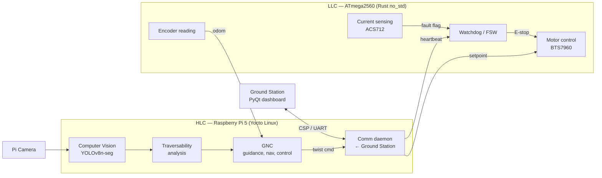
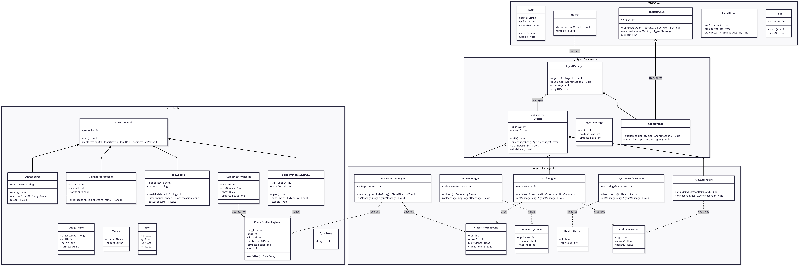
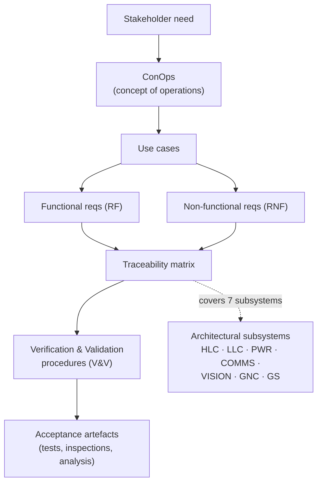
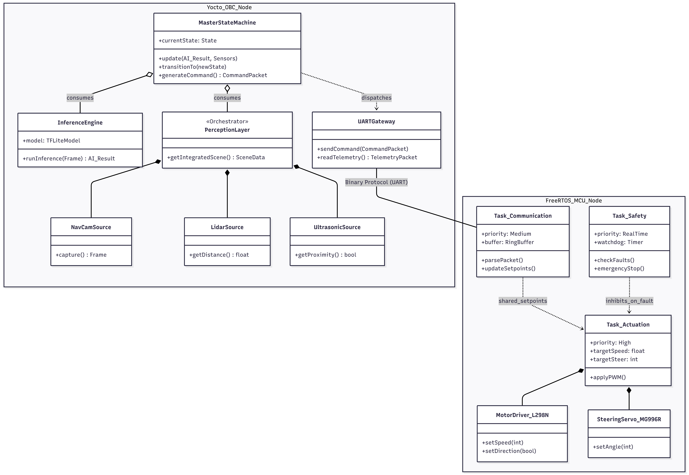
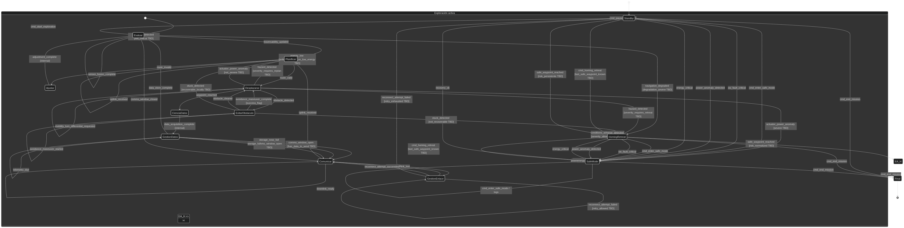
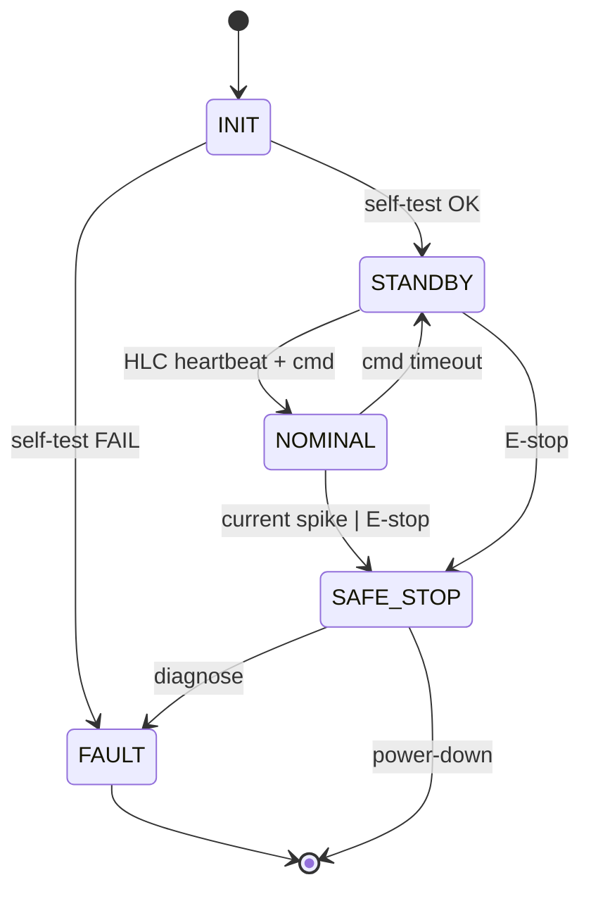

# Olympus Project — TFG

[](./LICENSE)
[](#)
[](#verification-status)
[](https://github.com/Alonso11/Olympus-Project-TFG-TEC/blob/main/docs/srs_latex/main.pdf)

[](#system-architecture)
[](#constraints)
[](#reactive-navigation)

> **TL;DR** — A CPU-only autonomous rover built to physically validate the **ELANaV**
> navigation software, raising it from TRL-3 (simulation) to **TRL-4** (integrated lab
> validation) under safety, budget, and compute constraints, with every design decision
> traceable to a formal IEEE 29148 SRS.

---

## Table of Contents

- [Overview](#overview)
- [System Architecture](#system-architecture)
  - [HLC / LLC Separation](#hlc--llc-separation)
  - [Data Flow](#data-flow)
  - [Software Architecture (from SRS)](#software-architecture-from-srs)
- [Requirements Engineering](#requirements-engineering)
  - [Flow](#flow)
  - [Verification Status](#verification-status)
  - [Use Cases](#use-cases)
- [Reactive Navigation](#reactive-navigation)
- [Behaviour & State Machines](#behaviour--state-machines)
- [Sub-component Repositories](#sub-component-repositories)
- [Repository Structure](#repository-structure)
- [Results](#results)
- [Standards and Compliance](#standards-and-compliance)
- [Constraints](#constraints)
- [Author & Institution](#author--institution)

---

## Overview

This repository contains the systems-engineering documentation for the **Olympus Project**
(Final Graduation Project, TFG): the design, integration, and verification of a CPU-only
rover platform built to enable the **physical validation of the ELANaV navigation
software**, previously stalled in simulation (TRL-3).

The work raises the platform to **TRL-4** (subsystems and interfaces integrated in the
laboratory) under real constraints — CPU-only compute, budget, and safety — while keeping
every design decision traceable to a formal SRS.

The engineering priorities, in order, are:
**(1) safety/determinism → (2) formal traceability → (3) honest realism (no over-promising).**

---

## System Architecture

### HLC / LLC Separation

The system splits work across two computers with deliberately different safety envelopes:

| Layer | Hardware | OS / Runtime | Role | Cycle |
|---|---|---|---|---|
| **HLC** (High-Level Controller) | Raspberry Pi 5 | Embedded Linux (Yocto Project) | GNC, computer vision (YOLOv8n-seg), traversability analysis, ground-station comms, watchdog | ≤ 2 s |
| **LLC** (Low-Level Controller) | ATmega2560 (Arduino Mega) | Rust `no_std` firmware | Motor control (BTS7960), encoder reading, ACS712 current sensing, hard real-time safety | 20 ms |

This separation guarantees that **a software fault on the HLC cannot compromise physical safety**:
the LLC stays in full authority over motors and can autonomously bring the rover to a safe
stop if the HLC misses its watchdog deadline or sends an out-of-range command.



### Software Architecture (from SRS)

The SRS documents the layered software stack with a SysML Block Definition Diagram. The
figure below is the rendered architecture diagram stored in the repository:

<p align="center">
  
</p>
<details>
<summary><b>High-resolution (1.2 MB PNG)</b></summary>

Direct link: [`software_arqui.png`](docs/srs_latex/figures/software_arqui.png)
</details>

---

## Requirements Engineering

### Flow

The project follows **ISO/IEC/IEEE 29148:2018**: every requirement descends from a
stakeholder need via the ConOps, and every requirement is linked to a verification
activity and an acceptance artefact.



### Verification Status

Formal status over the **12 system-level requirements**:

| Status | Count | Share | Note |
|---|---:|---:|---|
| ✅ Verified | 2 | 17% | Demonstration on integrated hardware |
| 🟡 Partial | 8 | 67% | Subsystem-level evidence; integration ongoing |
| ⏸ Descoped | 2 | 16% | Saved for TRL-5+; explicitly out of TFG scope |
| **Total** | **12** | 100% | |

### Use Cases

The top-level use-case diagram is stored in the repository:

<p align="center">
  
</p>

---

## Reactive Navigation

The CPU-only budget rules out dense SLAM. Instead, navigation uses **reactive obstacle
detection** with a YOLOv8n-seg instance-segmentation model running on the HLC. The image
below (from the SRS) shows the on-node inference pipeline:

<p align="center">
  
</p>

Key properties:

- **Model:** YOLOv8n-seg (nano + segmentation masks) — picked for CPU throughput at the
  2 s cycle budget.
- **Output:** traversability mask + obstacle bounding boxes, fed into the GNC planner.
- **Why reactive (not SLAM):** the CPU-only hardware envelope leaves no headroom for
  dense mapping on the target cycle. SLAM is *explicitly descoped* and documented as such
  in the SRS — this is part of the "honest realism" engineering principle.

---

## Behaviour & State Machines

The LLC's fault-response behaviour is captured as a finite-state machine. The figure below
is the rendered [state machine diagram from the SRS](docs/srs_latex/figures/maquina_estados.png):

<p align="center">
  
</p>

A high-level summary of the states:



---

## Sub-component Repositories

The system is split across specialized repositories, one per architectural layer:

| Layer | Repo | Role |
|---|---|---|
| **LLC** | [`rover-low-level-controller`](https://github.com/Alonso11/rover-low-level-controller) | Firmware in Rust for the ATmega2560 (motor control, encoders, ACS712, FSW) |
| **HLC** | [`olympus-hlc-rpi5`](https://github.com/Alonso11/olympus-hlc-rpi5) | Embedded Linux (Yocto) on the Raspberry Pi 5 (GNC, vision, traversability, comms) |
| **Ground Station** | `./ground_station/` (this repo) | Python / PyQt5 dashboard for telemetry, manual control, and monitoring |

---

## Repository Structure

```
Olympus-Project-TFG-TEC/
├── 📄 README.md                       # This file
├── 📄 CHANGELOG.md                    # Version history
├── 📄 LICENSE                         # MIT
├── .github/workflows/                 # CI for documentation quality
│
├── 📂 docs/
│   └── 📂 srs_latex/                  # **SOFTWARE REQUIREMENTS SPECIFICATION (LaTeX)**
│       ├── main.tex                   #   IEEE 29148 SRS document
│       ├── main.pdf                   #   Compiled SRS  ← download badge above
│       ├── sections/                  #   s01–s13 (context, ConOps, requirements…)
│       ├── icd/                       #   Interface Control Documents (CSP, UART/LLC)
│       ├── vv/                        #   Verification & Validation procedures
│       ├── figures/                   #   All diagrams referenced in this README
│       └── references.bib
│
├── 📂 ground_station/                 # Python/PyQt5 ground-station app (self-contained)
│   ├── olympus_gui.py
│   └── olympus_station.py
│
├── 📂 templates/                      # Reusable document templates
├── 📂 project_management/             # Meeting notes, decisions, task tracking
└── 📂 references/                     # Supporting research
```

**Reading order for reviewers:** `Overview` (above) → [SRS PDF](https://github.com/Alonso11/Olympus-Project-TFG-TEC/blob/main/docs/srs_latex/main.pdf) → `docs/srs_latex/sections/s11_v_v_acceptance.tex` for verification evidence.

---

## Results

- **TRL raised from 3 → 4** — ELANaV now executes on physical hardware, not only in simulation.
- **2 / 12 system requirements fully verified by demonstration** on integrated hardware;
  8 partially verified by inspection / analysis; 2 descoped (documented).
- **Dual HLC/LLC fault containment** demonstrated: the LLC reliably safe-stops the rover
  when the HLC watchdog is missed, isolating software faults from physical safety.
- **CPU-only reactive navigation** validated on a 2 s perception cycle using YOLOv8n-seg.

---

## Standards and Compliance

- **ISO/IEC/IEEE 29148:2018** — Systems and software engineering — Life-cycle processes — Requirements engineering.
- **ECSS** — referenced standards:
  - **E-ST-10-02C** — Verification
  - **E-ST-70-11** — Space systems autonomity levels

---

## Constraints

| Constraint | Value / Decision | Rationale |
|---|---|---|
| Compute | CPU-only (Pi 5, no GPU/NPU) | Cost, power, availability — drives reactive-not-SLAM decision |
| Perception cycle | ≤ 2 s | Set by mission-time budget on a traverse |
| LLC loop | 20 ms | Hard real-time motor control |
| Safety envelope | HLC faults cannot reach motors | Watchdog on LLC + out-of-range setpoint clipping |
| Traceability | 100 % RF/RNF → V&V activity | IEEE 29148 compliance |

---

## Author & Institution

**Fabián Alonso Gómez Quesada**<br>
Instituto Tecnológico de Costa Rica (TEC)<br>
School of Electronics Engineering<br>
SETEC Lab — Space Systems Laboratory

---